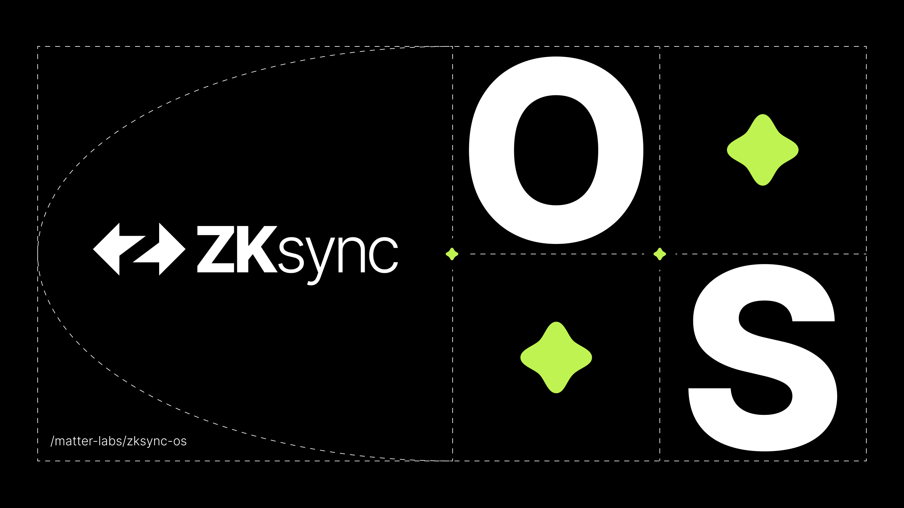

# ZKsync OS Server

[](https://zksync.io/)

## What is ZKsync OS Server?

ZKsync OS Server is the sequencer implementation for the [ZKsync OS](https://github.com/matter-labs/zksync-os),
the new operating system of the ZK Stack.<br>
The ZKsync OS Server design optimizes for throughput, low latency, and a seamless development experience.

## [Install](https://matter-labs.github.io/zksync-os-server/latest/setup) | [User docs](https://docs.zksync.io/zksync-network/zksync-os) | [Developer docs](https://matter-labs.github.io/zksync-os-server/latest/) | [](https://github.com/matter-labs/zksync-os-server/actions/workflows/ci.yml)

## Design principles

* Minimal, async persistence
  * to meet throughput and latency requirements, we avoid synchronous persistence at the critical path. Additionally,
    we aim at storing only the data that is strictly needed - minimizing the potential for state inconsistency
* Easy to replay arbitrary blocks
  * Sequencer: components are idempotent
  * Batcher: `batcher` component skips all blocks until the first uncommitted batch.
    Thus, downstream components only receive batches that they need to act upon 
* State - strong separation between
  * Actual state - data needed to execute VM: key-value storage and preimages map
  * Receipts repositories - data only needed in API
  * Data related to Proofs and L1 - not needed by sequencer / JSON RPC - only introduced downstream from `batcher`

## Quickstart

To run server locally with in-memory L1 node and dummy proofs, run the following commands:
```bash
# Start in-memory L1 node
anvil --load-state zkos-l1-state.json --port 8545
# Launch zksync-os-server on the default port 3050
# By default, fake (dummy) proofs are used both for FRI and SNARK proofs.
cargo run --release --bin zksync-os-server

# Use default rich account for testing
RICH_ACCOUNT=0x36615Cf349d7F6344891B1e7CA7C72883F5dc049
PRIVATE_KEY=0x7726827caac94a7f9e1b160f7ea819f172f7b6f9d2a97f992c38edeab82d4110

# Send test transaction
TO=0x5A67EE02274D9Ec050d412b96fE810Be4D71e7A0
cast send --private-key ${PRIVATE_KEY} --rpc-url http://localhost:3050 ${TO} --value 100
```

For more configuration and detailed instructions, check the [developer documentation](https://matter-labs.github.io/zksync-os-server/latest).

## Contributing

See [CONTRIBUTING.md](./CONTRIBUTING.md) for contribution guidelines.

## Security

See [SECURITY.md](./SECURITY.md) for security policy details.

## Policies

- [Security policy](SECURITY.md)
- [Contribution policy](CONTRIBUTING.md)

## License

ZKsync OS repositories are distributed under the terms of either

- Apache License, Version 2.0, ([LICENSE-APACHE](LICENSE-APACHE) or <http://www.apache.org/licenses/LICENSE-2.0>)
- MIT license ([LICENSE-MIT](LICENSE-MIT) or <https://opensource.org/blog/license/mit/>)

at your option.

## Official Links

- [Website](https://zksync.io/)
- [GitHub](https://github.com/matter-labs)
- [ZK Credo](https://github.com/zksync/credo)
- [Twitter](https://twitter.com/zksync)
- [Twitter for Developers](https://twitter.com/zkSyncDevs)
- [Discord](https://join.zksync.dev/)
- [Mirror](https://zksync.mirror.xyz/)
- [Youtube](https://www.youtube.com/@zkSync-era)
